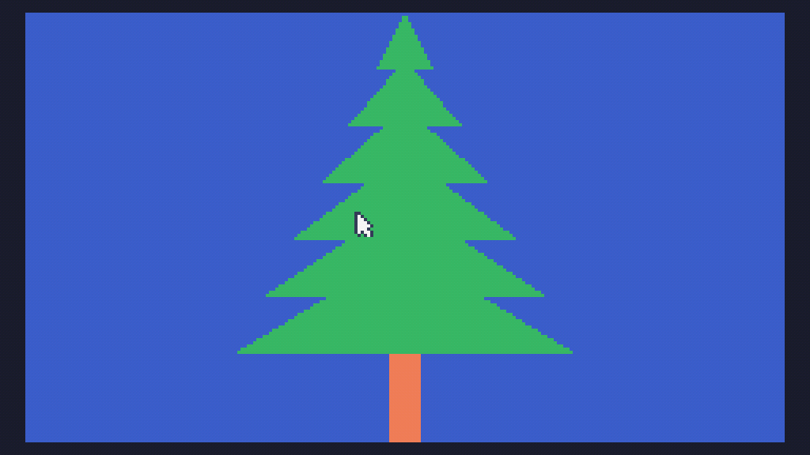
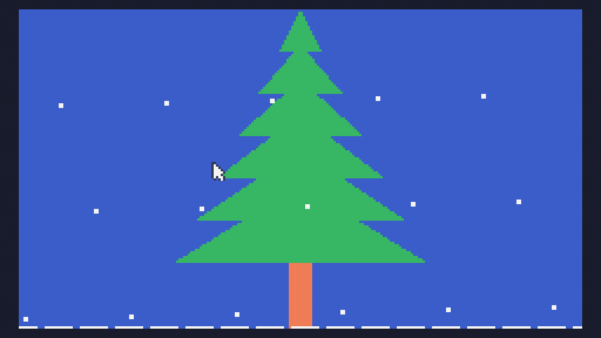
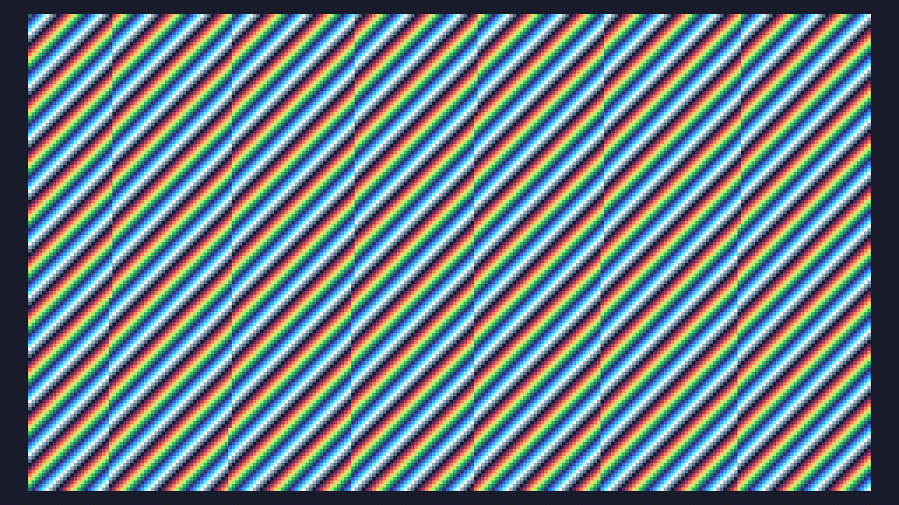
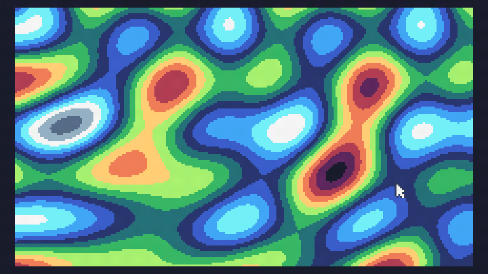
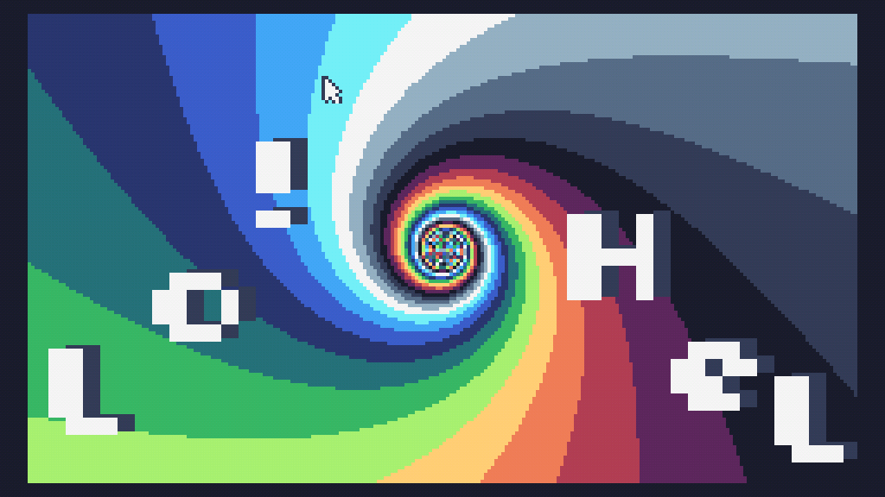
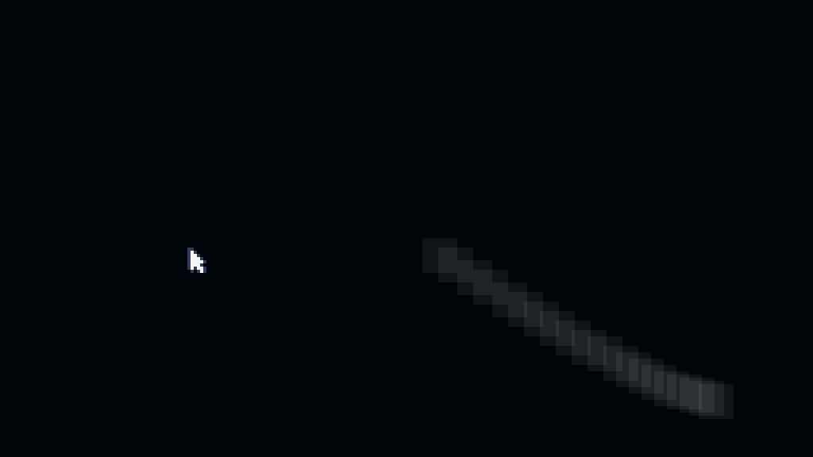
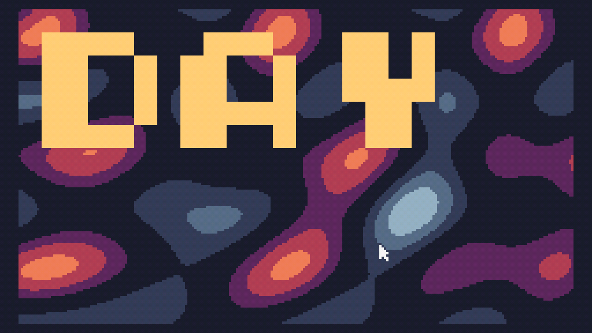

# 🎄 Tiny Code Christmas 2023

My demoscenes on [TIC-80](https://tic80.com/) for [Tiny Code Christmas](https://tcc.lovebyte.party/) 2023.

## Day 1 - Making Shapes

## Day 2 - Snow `time()` Like the Present

## Day 3 - Little By Little

## Day 4 - Sines of the Times

## Day 5 - Polar Express

## Day 6 - Hello, Demoscene!

## Day 7 - Mix and Match

## Day 8 - Round and Round

## Day 9 - Shade the Bob

## Day 10 - The Big Squeeze

